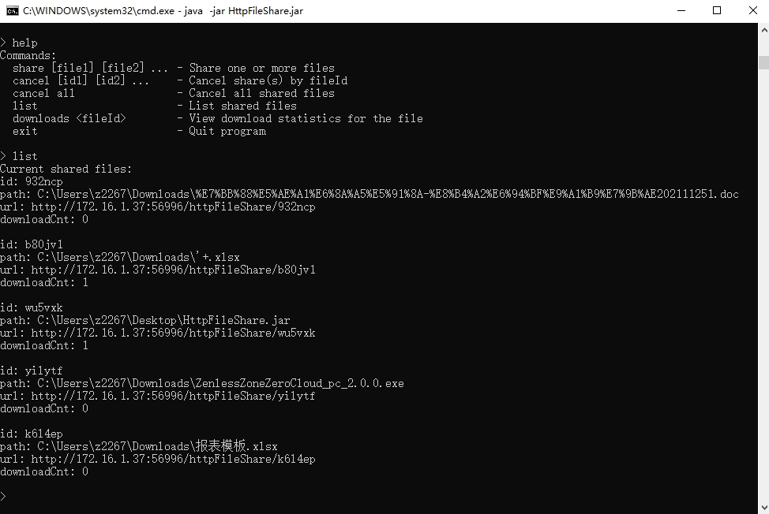

[English](README.md) | [中文](README_zh.md)

#### Purpose

This project was born out of the need for convenient file sharing within local networks.

* Convenient:Share a local file instantly via an HTTP address with just one click!
* Safe:No need to transfer files via FTP or WeChat servers.
* Collaboration:Support downloading files via QR code.
* CommandLine:Support cmd to share/cancel/list files,Compatible with headless systems.

#### Compare

Compared to Nginx and Python's http.server, the key differences are:While those can only serve files from predefined directories, HttpFileShare allows sharing files from any directory without configuration changes or server restarts.
It provides a graphical interface for easily sharing/unsharing files.

#### Parameters Explanation

| Parameter                  | Explanation                                                                                               |
|----------------------------|-----------------------------------------------------------------------------------------------------------|
| -DhttpFileShare.port=11111 | Specify the HTTP server port. If not specified, the system will randomly select an available unused port. |
| -DhttpFileShare.ip=172.16.1.37 | Specify the IP address for the HTTP server, typically used for computers with multiple network interfaces.|

#### Demonstration Video

[Bilibili Video](https://www.bilibili.com/video/BV1XHTezDEDC/)

#### Screenshots

